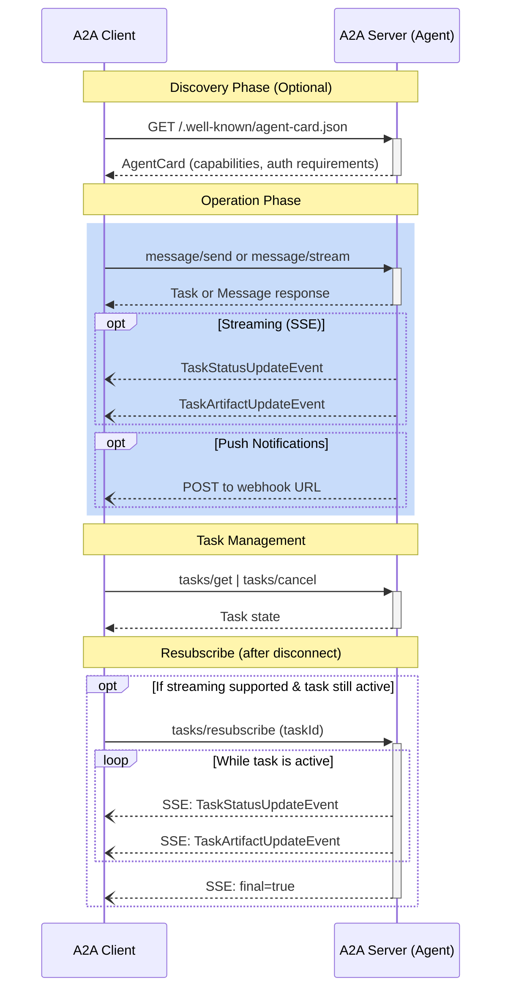
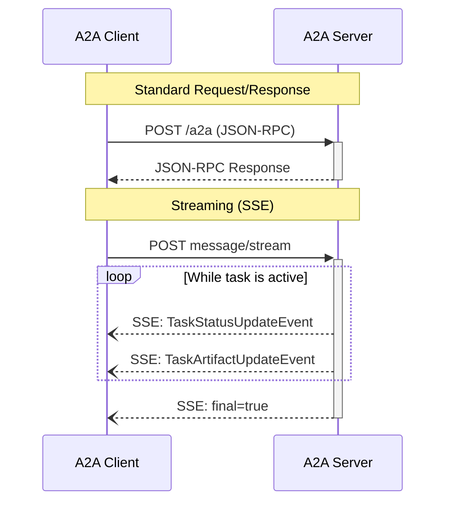
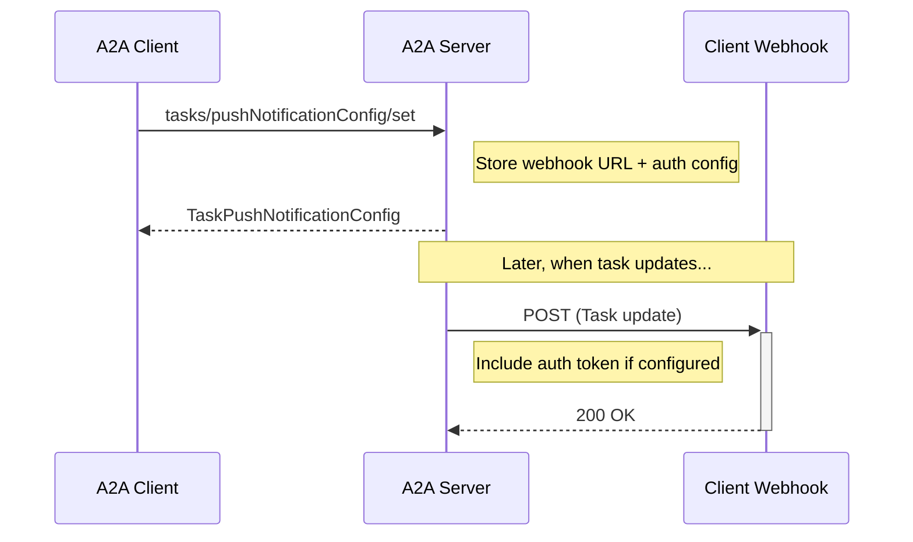
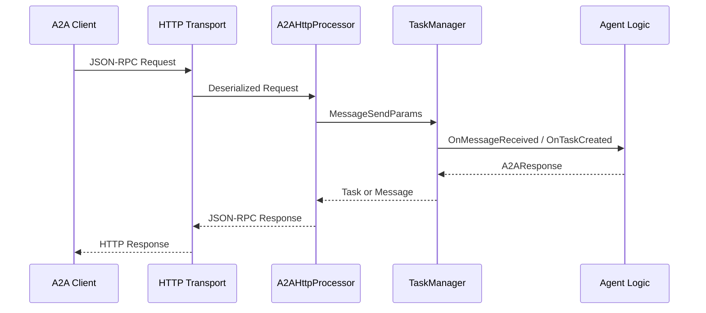

# A2A .NET SDK Threat Model

## Summary

The [A2A .NET SDK](https://github.com/a2aproject/a2a-dotnet) enables .NET developers to build clients and servers that implement the [Agent2Agent (A2A) Protocol](https://a2a-protocol.org/v0.3.0/) for AI agent interoperability. The SDK provides a framework for AI agents to discover each other, exchange messages, manage tasks, and collaborate—all without exposing their internal state, memory, or tools to each other.

Unlike tool-focused protocols, A2A treats agents as standard enterprise HTTP applications, enabling them to communicate as opaque peers while leveraging existing web security infrastructure for authentication, authorization, and transport security.

The A2A .NET SDK contains two main packages:

- **[A2A](https://www.nuget.org/packages/A2A/)** - Core client/server APIs including `A2AClient`, `A2ACardResolver`, `TaskManager`, and all protocol data models
- **[A2A.AspNetCore](https://www.nuget.org/packages/A2A.AspNetCore/)** - ASP.NET Core integration for hosting A2A agents with HTTP and JSON-RPC endpoints

## Lifecycle

A2A communication follows an HTTP request/response model. Unlike MCP, there is no mandatory initialization handshake—agents can immediately begin exchanging messages or managing tasks.



[A2A Protocol Specification - Transport and Format](https://a2a-protocol.org/v0.3.0/specification/#3-transport-and-format)

The SDK does not enforce lifecycle validation. A client can send any valid A2A request without prior discovery of the Agent Card.

## Capabilities

### Server (A2A Agent)

| Category | Capability | Description |
| -------- | ---------- | ----------- |
| Core | `message/send` | Receive and process [messages](https://a2a-protocol.org/v0.3.0/specification/#71-messagesend) from clients |
| Core | `tasks/get` | Return [task status and history](https://a2a-protocol.org/v0.3.0/specification/#73-tasksget) |
| Core | `tasks/cancel` | Handle [task cancellation](https://a2a-protocol.org/v0.3.0/specification/#74-taskscancel) requests |
| Optional | `streaming` | Server-Sent Events for [real-time updates](https://a2a-protocol.org/v0.3.0/specification/#72-messagestream) |
| Optional | `pushNotifications` | Asynchronous [webhook callbacks](https://a2a-protocol.org/v0.3.0/specification/#75-taskspushnotificationconfigset) |
| Optional | `stateTransitionHistory` | Provide task state transition history |

### Client

| Category | Capability | Description |
| -------- | ---------- | ----------- |
| Core | Agent Discovery | Resolve [Agent Cards](https://a2a-protocol.org/v0.3.0/specification/#5-agent-discovery-the-agent-card) from well-known URLs |
| Core | Message Sending | Send messages and initiate tasks |
| Core | Task Management | Query, poll, and cancel tasks |
| Optional | Streaming | Subscribe to SSE streams for real-time updates |
| Optional | Push Notification Handling | Receive webhook callbacks for task updates |

[A2A Protocol Specification - Compliance Requirements](https://a2a-protocol.org/v0.3.0/specification/#11-a2a-compliance-requirements)

## Actors

**1. A2A Client (Calling Agent or Application)**
- **Role**: Initiates A2A connections, sends messages, creates and manages tasks, processes responses
- **Trust Level**: Untrusted - Could represent legitimate agent systems but may send malicious requests or attempt prompt injection
- **Capabilities**: Send JSON-RPC/HTTP requests, authenticate (OAuth 2.0, API keys), subscribe to SSE streams, receive push notifications

**2. A2A Server (Remote Agent)**
- **Role**: Hosts A2A endpoints, processes messages, executes agent logic, manages task lifecycle, sends streaming updates and push notifications
- **Trust Level**: Partially trusted - Agents should be verified through Agent Card discovery, but the SDK cannot guarantee the trustworthiness of remote agents
- **Capabilities**: Process requests, execute agent logic, access backend resources, send webhook callbacks to client-provided URLs

**3. User/Operator**
- **Role**: End user who interacts with applications using A2A agents, configures agent connections, provides credentials
- **Trust Level**: Partially trusted - Users may provide malicious input that gets forwarded to agents. Operators configure security settings
- **Capabilities**: Provide input to applications, configure A2A connections, authorize OAuth flows, deploy and configure A2A agents

**4. Webhook Receiver (Push Notification Target)**
- **Role**: HTTP endpoint that receives asynchronous task updates from A2A servers
- **Trust Level**: Untrusted from server perspective - URL is client-provided and could be used for SSRF attacks
- **Capabilities**: Receive HTTP POST requests with task updates from A2A servers

## What We Are Protecting

Protecting: **Confidentiality, Integrity, Availability**

As a foundational SDK that enables AI agents to communicate and collaborate, the A2A .NET SDK must protect against:

**SDK Responsibilities:**
- **SSRF via Push Notifications**: Preventing malicious clients from using push notification configurations to make the server send requests to internal resources
- **Resource exhaustion**: Preventing denial-of-service attacks that could overwhelm server resources through excessive requests, large payloads, or long-running SSE connections
- **Sensitive information disclosure**: Ensuring that internal exception details, stack traces, or sensitive data are not leaked in error responses

**Application Developer Responsibilities:**
- **Authentication bypass**: Ensuring that authentication and authorization controls cannot be circumvented (SDK provides extensibility, application implements)
- **Prompt injection**: Preventing malicious input from clients that could manipulate agent behavior or data access
- **Data exfiltration**: Protecting sensitive application data from unauthorized access through message content or task artifacts
- **Task manipulation**: Preventing unauthorized access to tasks owned by other users/agents

## Trust Boundaries

### Network Boundary (HTTP Transport)

The network represents the primary trust boundary where external A2A clients connect to servers over HTTP/HTTPS. All client communications are considered potentially malicious.



[A2A Protocol Specification - Streaming Transport](https://a2a-protocol.org/v0.3.0/specification/#33-streaming-transport-server-sent-events)

**Security Controls:**
- TLS 1.2+ encryption (HTTPS required for production)
- Standard HTTP authentication via headers
- JSON-RPC message validation
- Server-Sent Events for streaming

#### Risk: HTTP-based Denial of Service (DoS) Attacks

SSE connections for streaming can be long-lived, potentially consuming server resources. Each `message/stream` or `tasks/resubscribe` request maintains an open HTTP connection until the task completes or the client disconnects.

**Current SDK implementation ([`TaskManager.cs`](https://github.com/a2aproject/a2a-dotnet/blob/main/src/A2A/Server/TaskManager.cs)):**
- Uses `IAsyncEnumerable<A2AEvent>` which naturally supports cancellation
- Streaming connections are tied to task lifecycle
- The default [`InMemoryTaskStore`](https://github.com/a2aproject/a2a-dotnet/blob/main/src/A2A/Server/InMemoryTaskStore.cs) stores all tasks in memory without automatic cleanup

**Mitigations (application developer responsibility):**
- Configure Kestrel/IIS request body size limits and timeout settings
- Implement rate limiting middleware
- Implement task cleanup/expiration policies in custom `ITaskStore` implementations
- Use ASP.NET Core's built-in response compression and buffering features

#### Risk: SSRF via Push Notification URLs

Clients can configure push notification URLs where the server will send HTTP POST requests with task updates. A malicious client could provide internal URLs to probe or attack internal services.

**Current SDK implementation ([`TaskManager.cs`](https://github.com/a2aproject/a2a-dotnet/blob/main/src/A2A/Server/TaskManager.cs)):**
- Stores push notification configurations via `SetPushNotificationAsync`
- The `HttpClient` for making callbacks is currently placeholder (`// TODO: Use callbackHttpClient`)

**Mitigations (application developer responsibility):**
- Validate and whitelist push notification URLs before accepting them
- Use a dedicated `HttpClient` with restricted permissions for callbacks
- Implement URL filtering to block internal IP ranges and localhost
- Consider requiring authentication of webhook endpoints

[A2A Protocol Specification - Push Notification Security](https://a2a-protocol.org/v0.3.0/topics/streaming-and-async/#security-considerations-for-push-notifications)

### Push Notification Boundary

When push notifications are enabled, the A2A server makes outbound HTTP requests to client-provided webhook URLs.



[A2A Protocol Specification - Push Notifications](https://a2a-protocol.org/v0.3.0/specification/#68-pushnotificationconfig-object)

**Security Controls:**
- Client provides authentication info via `PushNotificationAuthenticationInfo`
- Server should validate its identity to webhook using provided credentials
- Client webhook should validate incoming notifications

#### Risk: Webhook Authentication Bypass

If the server doesn't properly authenticate to the webhook, or the webhook doesn't validate the server, attackers could:
- Spoof task update notifications to the client
- Intercept or modify task data in transit

**Current SDK implementation ([`PushNotificationAuthenticationInfo.cs`](https://github.com/a2aproject/a2a-dotnet/blob/main/src/A2A/Models/PushNotificationAuthenticationInfo.cs)):**
- Supports `schemes` (e.g., "Bearer", "Basic") and optional `credentials`
- Actual authentication implementation is application responsibility

**Mitigations (application developer responsibility):**
- Always use HTTPS for webhook URLs
- Implement proper authentication when sending push notifications
- Include and validate notification tokens
- Verify TLS certificates of webhook endpoints

## Data Description

### JSON-RPC Messages

All A2A messages are serialized and deserialized using `System.Text.Json` with strongly-typed data structures matching the [A2A schema](https://a2a-protocol.org/v0.3.0/specification/#6-protocol-data-objects). The SDK uses source-generated JSON serialization via [`A2AJsonUtilities`](https://github.com/a2aproject/a2a-dotnet/blob/main/src/A2A/Serialization/A2AJsonUtilities.cs) for performance and AOT compatibility.



**Security Controls:**
- Source-generated serialization with explicit type handling
- Polymorphic deserialization using type discriminators (`kind` property)
- Custom converters for discriminated unions (`A2AEvent`, `Part`, `FileContent`)

The `System.Text.Json` threat model applies: [System.Text.Json Threat Model](https://github.com/dotnet/runtime/blob/18ae5dd6c117f3365f7a338b567f5edb9be12051/src/libraries/System.Text.Json/docs/ThreatModel.md)

### Agent Card

The [`AgentCard`](https://github.com/a2aproject/a2a-dotnet/blob/main/src/A2A/Models/AgentCard.cs) contains agent metadata, capabilities, and authentication requirements. It is fetched by clients during discovery.

**Security considerations:**
- Agent Cards may expose sensitive capability information
- Cards should not contain plaintext secrets
- Protected agents may require authentication to fetch extended cards

[A2A Protocol Specification - Agent Card Security](https://a2a-protocol.org/v0.3.0/specification/#54-security-of-agent-cards)

### Message Parts and Artifacts

Messages and artifacts can contain various content types via the polymorphic `Part` type:

| Part Type | Security Considerations |
| --------- | ---------------------- |
| [`TextPart`](https://github.com/a2aproject/a2a-dotnet/blob/main/src/A2A/Models/Part.cs) | May contain prompt injection attempts |
| [`FilePart`](https://github.com/a2aproject/a2a-dotnet/blob/main/src/A2A/Models/Part.cs) (bytes) | Base64-encoded content may be large, needs size limits |
| [`FilePart`](https://github.com/a2aproject/a2a-dotnet/blob/main/src/A2A/Models/Part.cs) (URI) | URIs could point to malicious or internal resources |
| [`DataPart`](https://github.com/a2aproject/a2a-dotnet/blob/main/src/A2A/Models/Part.cs) | Structured JSON data, needs schema validation |

#### Risk: Sensitive Information Disclosure in Error Handling

The SDK handles exceptions in [`A2AHttpProcessor.cs`](https://github.com/a2aproject/a2a-dotnet/blob/main/src/A2A.AspNetCore/A2AHttpProcessor.cs):

```csharp
catch (A2AException ex)
{
    logger.A2AErrorInActivityName(ex, activityName);
    return MapA2AExceptionToHttpResult(ex);
}
catch (Exception ex)
{
    logger.UnexpectedErrorInActivityName(ex, activityName);
    return Results.Problem(detail: ex.Message, statusCode: StatusCodes.Status500InternalServerError);
}
```

**Current behavior:**
- `A2AException` messages are returned to clients (expected/safe errors)
- Unexpected exceptions return `ex.Message` which may contain sensitive information

**Mitigations (application developer responsibility):**
- Configure exception handling middleware to sanitize error messages in production
- Use structured logging with appropriate PII filtering
- Implement custom exception filters if needed

## Authentication and Authorization

A2A delegates authentication to standard HTTP mechanisms. The SDK provides extensibility points but does not implement authentication itself.

### Supported Security Schemes

The SDK supports all OpenAPI-compatible security schemes via [`SecurityScheme`](https://github.com/a2aproject/a2a-dotnet/blob/main/src/A2A/Models/SecurityScheme.cs):

| Scheme Type | Class | Description |
| ----------- | ----- | ----------- |
| API Key | [`ApiKeySecurityScheme`](https://github.com/a2aproject/a2a-dotnet/blob/main/src/A2A/Models/SecurityScheme.cs) | API key in header, query, or cookie |
| HTTP Auth | [`HttpAuthSecurityScheme`](https://github.com/a2aproject/a2a-dotnet/blob/main/src/A2A/Models/SecurityScheme.cs) | HTTP authentication (Bearer, Basic) |
| OAuth 2.0 | [`OAuth2SecurityScheme`](https://github.com/a2aproject/a2a-dotnet/blob/main/src/A2A/Models/SecurityScheme.cs) | OAuth 2.0 flows |
| OpenID Connect | [`OpenIdConnectSecurityScheme`](https://github.com/a2aproject/a2a-dotnet/blob/main/src/A2A/Models/SecurityScheme.cs) | OIDC discovery |
| Mutual TLS | [`MutualTlsSecurityScheme`](https://github.com/a2aproject/a2a-dotnet/blob/main/src/A2A/Models/SecurityScheme.cs) | Client certificate authentication |

[A2A Protocol Specification - Authentication and Authorization](https://a2a-protocol.org/v0.3.0/specification/#4-authentication-and-authorization)

### Client Authentication

The [`A2AClient`](https://github.com/a2aproject/a2a-dotnet/blob/main/src/A2A/Client/A2AClient.cs) accepts an `HttpClient` parameter, allowing applications to configure authentication:

```csharp
// Application configures authentication on HttpClient
var httpClient = new HttpClient();
httpClient.DefaultRequestHeaders.Authorization = 
    new AuthenticationHeaderValue("Bearer", accessToken);

var client = new A2AClient(new Uri("https://agent.example.com/a2a"), httpClient);
```

**Application developer responsibility:**
- Configure `HttpClient` with appropriate authentication headers
- Handle token refresh for OAuth flows
- Securely store and manage credentials

### Server Authentication

The ASP.NET Core integration uses standard ASP.NET Core authentication/authorization middleware:

```csharp
app.MapA2A(taskManager, "/a2a")
    .RequireAuthorization("A2APolicy"); // Application-defined policy
```

**Application developer responsibility:**
- Configure ASP.NET Core authentication handlers
- Define authorization policies
- Implement user/task ownership validation

#### Risk: Missing Authorization on Task Operations

Tasks may contain sensitive data from multiple users. Without proper authorization, users could:
- Access other users' task history
- Cancel tasks they don't own
- Read artifacts from unauthorized tasks

**Current SDK implementation:**
- No built-in task ownership/authorization
- All task operations rely on application-level middleware

**Mitigations (application developer responsibility):**
- Store user/client identity with tasks
- Validate ownership in `OnTaskCreated`, `OnTaskUpdated`, `OnTaskCancelled` callbacks
- Implement custom `ITaskStore` with authorization checks
- Use ASP.NET Core authorization policies

## Security Assumptions

### Dependencies and Infrastructure

| Component | Assumption | Reference |
| --------- | ---------- | --------- |
| **System.Text.Json** | Provides safe JSON serialization/deserialization | [System.Text.Json threat model](https://github.com/dotnet/runtime/blob/18ae5dd6c117f3365f7a338b567f5edb9be12051/src/libraries/System.Text.Json/docs/ThreatModel.md) |
| **ASP.NET Core** | Provides secure HTTP handling, routing, and authentication | [ASP.NET Core security documentation](https://docs.microsoft.com/aspnet/core/security/) |
| **System.Net.Http** | Provides safe HTTP client functionality | [HttpClient threat model](https://github.com/dotnet/runtime/blob/main/src/libraries/System.Net.Http/docs/ThreatModel.md) |
| **Kestrel/IIS** | Provides HTTP server security features, rate limiting, size limits | Platform documentation |

### Operational Environment

- **Transport Security**: HTTP transport assumes HTTPS is properly configured with valid certificates and strong TLS settings (TLS 1.2+ recommended). Mixed HTTP/HTTPS is not supported in production.

- **Authentication Configuration**: Applications must properly configure authentication middleware. The SDK does not validate that authentication is enabled.

- **Agent Trust**: Applications should verify Agent Cards from trusted sources. The SDK cannot verify agent trustworthiness automatically.

- **Task Data Sensitivity**: Task history, messages, and artifacts may contain sensitive data. Applications must implement appropriate access controls.

- **Push Notification Security**: Webhook URLs should be validated. Servers should authenticate to webhooks. Clients should validate incoming notifications.

### Comparison with MCP C# SDK

| Aspect | MCP C# SDK | A2A .NET SDK |
| ------ | ---------- | ------------ |
| **Transport** | STDIO, HTTP (SSE, Streamable HTTP) | HTTP only (JSON-RPC, SSE) |
| **Initialization** | Required handshake | No handshake required |
| **Session Management** | Session IDs, stateful | Stateless HTTP, task-based state |
| **Purpose** | Agent-to-tool communication | Agent-to-agent communication |
| **Process Execution** | Spawns child processes (STDIO) | No process spawning |
| **Webhook/Callbacks** | N/A | Push notifications (SSRF risk) |

## Recommendations

### For SDK Maintainers

1. **Implement SSRF protections** for push notification callbacks:
   - Add URL validation helpers
   - Consider blocking private IP ranges by default
   - Document SSRF risks prominently

2. **Add task cleanup mechanisms** to `InMemoryTaskStore`:
   - Configurable TTL for completed tasks
   - Maximum task count limits

3. **Review error handling** to ensure sensitive information is not disclosed:
   - Consider making exception message exposure configurable
   - Add sanitization for unexpected exceptions

### For Application Developers

1. **Always use HTTPS** in production deployments

2. **Implement authentication and authorization**:
   - Configure ASP.NET Core authentication middleware
   - Implement task ownership validation
   - Use authorization policies on A2A endpoints

3. **Validate push notification URLs**:
   - Whitelist allowed URL patterns
   - Block internal IP ranges
   - Require HTTPS for webhooks

4. **Set appropriate resource limits**:
   - Configure Kestrel body size limits
   - Implement rate limiting
   - Set timeouts for long-running operations

5. **Implement task lifecycle management**:
   - Use custom `ITaskStore` for persistent storage
   - Implement task expiration/cleanup
   - Consider multi-tenancy requirements

6. **Handle sensitive data appropriately**:
   - Sanitize user input before forwarding to agents
   - Implement audit logging for sensitive operations
   - Follow data privacy regulations (GDPR, HIPAA, etc.)

## References

- [A2A Protocol Specification v0.3.0](https://a2a-protocol.org/v0.3.0/specification/)
- [A2A Enterprise Implementation Guide](https://a2a-protocol.org/v0.3.0/topics/enterprise-ready/)
- [A2A .NET SDK GitHub Repository](https://github.com/a2aproject/a2a-dotnet)
- [A2A Security Considerations](https://a2a-protocol.org/v0.3.0/specification/#102-security-considerations-summary)
- [ASP.NET Core Security Documentation](https://docs.microsoft.com/aspnet/core/security/)
